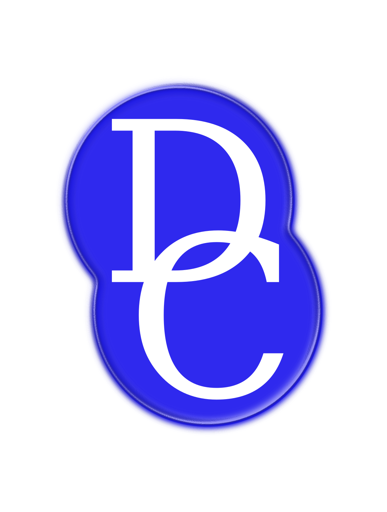

# Diversity Challenge



*A python code written to run the Diversity Challenge quiz event for the Raspberry Pi and associated hardware.*

This code can be adapted for other ideas and is made available for anyone to use and adapt for whatever purpose. We only advise that the coder be familiar with the basics of python.

---

## Getting Started


These instructions will enable you to run the software, how to add questions, and some hints on how you can edit the code for your quiz idea.

---

### What you need to make general use of the code

```
1. A raspberry pi (tested on Pi 3 Model B+)
2. Raspbian installed
3. Pygame and its dependencies
```

The code "should" work on a computer with a linux distribution, in this case you will need to remove the reference to the RPi module and the GPIO system of the RPi. The dependency on Pygame is still there however.

---

### What you need to run a DC style event

```
1. A Raspberry Pi 3 Model B+ (what it was originally used on)
2. Raspbian installed
3. Pygame and its dependencies
(see https://www.pygame.org/wiki/GettingStarted)
4. Buzzer/button setup (push buttons on breadboards or Dome buttons). (1)
```
You can of course use this code without the Diversity Challenge Buzzer setup, and make your own.

(1) We will be releasing a website soon with further information on how you can get DC to come to your place of work/school/university/institution to host a DC quiz event and/or hardware making event. 

---

### Installing the code

Open the terminal on your Raspberry Pi (RPi) and type `ls`. It should say

> /home/pi

. Next run this command in the terminal

```
git clone https://github.com/patherlkd/Diversity-Challenge.git
```
, if you get any error messages please see this guide: https://help.github.com/en/articles/cloning-a-repository. To check the code works change to the Diversity-Challenge directory `cd Diversity-Challenge` and run `python3.6 DC_main.py`, the start screen should appear.

---

### Running the code

To run the code as it is (HDMI audio) execute

```
python3.6 DC_main.py
```
or to run with Aux audio output, un-comment and comment out the relevant lines (labelled with HDMI and Aux audio) in `diversity_challenge.sh` and execute

```
bash diversity_challenge.sh
```
which may require root access, but on the RPi it should be fine. If you are not the owner of the RPi and the root access has been modified, please contact whoever owns the RPi.

---

### Adding questions

The Diversity Challenge code requires a database of questions. This database is located at
> DC_QUESTIONS/questions/questions.csv

which is structured as follows
> N/A, author, contact, category, question, answer

. The structure is due to the initial construction of the Diversity Challenge database, you can, of course, change this structure in the code (see *DC_QUESTIONS/DC_questions.py*). Please keep the fields in pure text format.

---

### Adding picture questions

All picture questions are stored as an image file `image.jpg` and a text file `info.txt` which contain the picture and associated answer respectively. Both these files, for a particular question, live in a directory named `question_<number>` in `DC_QUESTIONS/questions/picture_round/` where `<number>` is a question number. **The `<number>` field must run from 1 to `N`, where `N` is a positive whole number, _inclusive_ of all numbers between 1 and `N`**.

---

### Hints on personalising the code

The uses and possibilities for the code are endless, it only requires creativity and imagination on your part. However, there are easy ways to start changing the code to use with your colleagues, classmates, friends, family etc. by changing the player names and pictures.

In the `DC_main.py` file you can see the `bteam_players = ("Abbot","Odekunle","Cheung","Chamberlain")` line. This sets the name of the players and also tells the code which picture to associate to which player. These pictures are stored in
> DC_TEAM/contestants

for example `Abbot` has a picture named `Abbot_DC_badge.png`. **If you want to change `Abbot` to `John` you must create a picture named `John_DC_badge.png`**.

You can also add new modes to the main menu through amendments of the `DC_mode` dictionary located in `DC_modes.py`. For example, if you were making a revision tool for your exams you could make a mode for each of your subjects and make separate databases for them.
